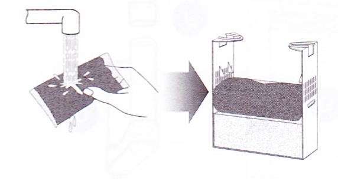
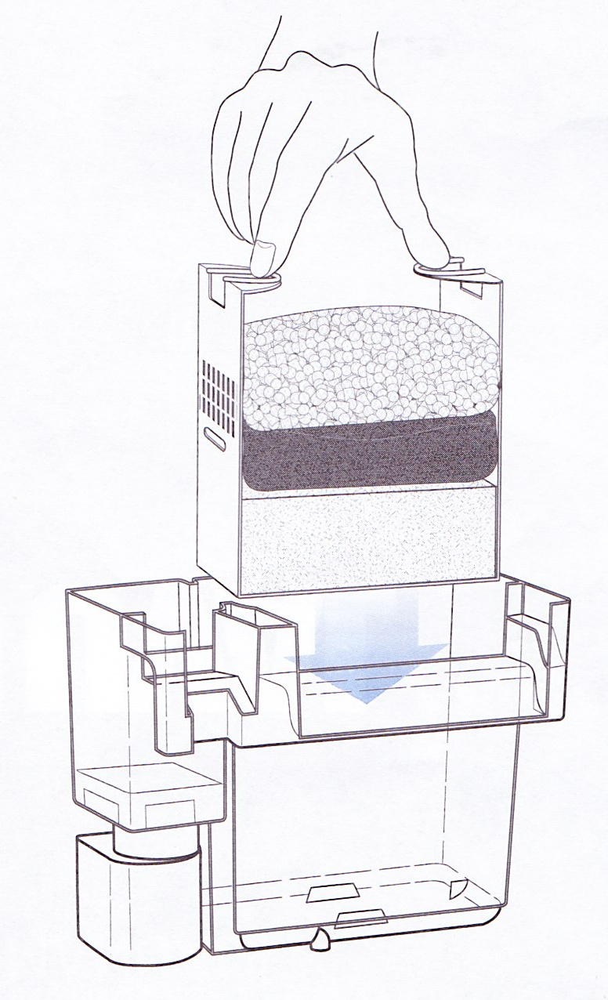
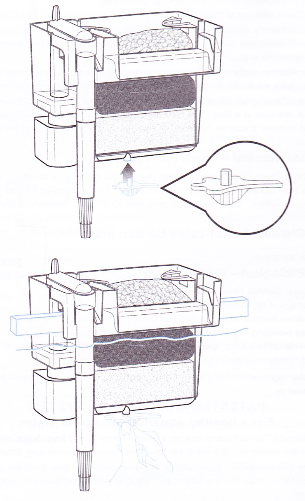
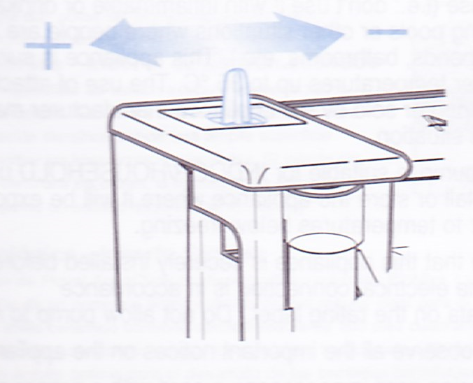

# AquaClear power filter

**Manufacturer**: [Fluval](https://fluvalaquatics.com/us/)  
**Models**: **20**, 30, 50, 70, 110

Congratulations on the purchase of your new Fluval AquaClear Power Filter. Please allow approximately 15-20 minutes for the complete installation of filter parts and inserts. The rewards to your aquatic adventures will be worth it!

* [Important safeguards](#Important-safeguards)
* [Parts](#Parts)
* Setup
  * [Filter preparation](#Filter-preparation)
  * [Filter insert installation](#Filter-insert-installation)
  * [Intake tube](#Intake-tube)
  * [Leveling device](#Leveling-device)
  * [Startup](#Start-up)
* [Maintenance](#Maintenance)
* [Troubleshooting](#Troubleshooting)
* [Specifications](#Specifications)
  * [Replacement parts](#Replacement-parts)
* [Contact](#Contact)
* [Guarantee](#Guarantee)
* [How it works](#How-it-works)

## Important safeguards

**To guard against injury, basic safety precautions should be observed, including the following: For the complete enjoyment, use, and understanding of this product, read and follow all safety insructions and all-important notices on the Fluval AquaClear Power Filter before using. Failure to do so may result in damage to the unit.**

### DANGER

To avoid possible electical show, special sare should be taken since water is employed in the use of this equipment. For each of the following situations, do not attempt repairs yourself; return the appliance to an authorized service facility for service, or discard the appliance.  
1. If the motor unit falls into the water **do not** reach for it! First unplug it anf then retrieve it. If any of the electrical components of the appliance gets wet, unplug it immediately.
1. If the motor unit shows any sign of abnormal water leakage or if RCD (or GFCI - Ground Fault Current Interrupter) switches off disconnect the power supply cord from mains and remove pump from water.
1. Carefully examine the appliance after installation. It should not be plugged in if there is water on parts not intended to be wet.
1. Do not operate any appliance if it has a damaged cord or plug, or if it is malfunctioning or if it is dropped or damaged in any manner. The power cord of this appliance cannot be replaced; if the cord is damaged, the appliance should be discarded. Never cut the cord.
1. To avoid the possibility of the appliance's plug or receptacle getting wet, position the unit to one side of a wall mounted receptacle to prevent water from dripping onto the receptacle or plug. A "drip loop" (**A**) should be arranged to the receptacle. The "drip loop" is the part of the cord below the level of the receptacle or the connector if an extension cord is used, to prevent water traveling along the cord and coming into contact with the receptacle. If the plug or the receptacle does get wet, **do not** unplug the cord. Disconnect the fuse or circuit breaker that supplies power to the appliance. Then unplug and examine for presence of water in the receptacle.

### WARNING

This appliance can be used by children aged from 8 years and above and persons with reduced physical, sensory, or mental capabilities or lack of experience and knowledge if they have been given supervision or instruction concerning use of the appliance in a safe way and understand the hazards involved. Children shall not play with the appliance. Cleaning and user maintenance shall not be made by children without supervision.

To avoid injury, do not contact moving parts or hot parts such as heaters, reflectors, lamp bulbs, etc.

### CAUTION

1. Always unplug or disconnect all appliances in the aquarium from electricity supply before placing hands in water, before putting on or taking off parts and whilst the equipment is being installed, maintained, or handled. When inserting or removing the pump from the water, always pull out the main electricity plug. Never yank cord to pull plug from outlet. Grasp the plug and pull to disconnect. Always unplug an appliance from an outlet when not in use.
1. This applianceis a non-submersible aquariumfilter pump for use in ornamental aquariums. Do not use this appliance for other than its intended use (e.g., don't use it with inflammable or drinkable liquids, in swimming pools or other situations where people are immersed, in garden ponds, bathrooms, etc.). This appliance is suitable for use in water temperatures up to 35°C. The use of attachments not recommended or sold by the appliance manufacturer may cause a dangerous situation.
1. This filter pump is suitable for INDOOR/HOUSEHOLD use only. Do not install or store the appliance where it will be exposed to the weather or to temperatures below freezing.
1. Make sure that this appliance is securely installed before operating it and that the electrical connection is in accordance with the data on the rating label. Do not allow pump to run dry.
1. Read and observe all the important notices on the appliance.
1. If an extension cord is necessary, a cord with the proper rating should be used. A cord rated for less amperes or watts than the appliance rating may overheat. Care should be taken to arrange the cord so that it will not be tripped over or pulled. The connection should be carried out by a qualified electrical installer.

**Save these instructions**  
For the complete use and understanding of this power filter it is recommended that this manual is thoroughly read and understood. Failure to do so may result in damage to the filter.

## Parts

Inspect the power filter for any visible signs of shipping damage and verify that motor is securely fastened to filter case. The following parts should be included in your package:

* Filter cover
* Filter case
* Filter basket
* Motor
* Intake "U" tube
* Extension tube*
* Leveling decive
* Foam
* Carbon
* Mesh bag
* Locking clip
* BioMax

\* *All Fluval AquaClear power filters, except Model 20, are shipped with 2 extension tubes*

## Setup

### Filter preparation

**All filter inserts must be rinsed thoroughly prior to installation**

**Regular replacement of Fluval AquaClear filter inserts is essential for optimum filter performance.**  
Fluval AquaClear Foam, Carbon, and BioMax inserts should be changed alternately in order to maintain continuous biological activity. Follow individual packaging instructions for recommended replacement intervals.  
*Never replace all filtter inserts in any Fluval AquaClear power filter at the same time.*

**Fluval AquaClear Foam**: Rinse foam insert and place into filter basket first. The foam block should totally fill the bottom of the basket leaving no space between the filter basket base and sides. *Replace foam insert every 2 months.*

**Fluval AquaClear Carbon**: Remove carbon insert from dust sleeve and rinse pouch to remove any carbon dust particles. Flatten carbon insert and place horizontally on top of foam insert. *Replace carbon insert every month.*

**Fluval AquaClear BioMax**: Open poly bag and transfer contents into mesh bag. Apply locking clip as shown, trim excess mesh, and thoroughly rinse insert materials before placing on third level of the basket. *Replace BioMax insert every 3 months.*

### Filter insert installation

After preparing filter inserts as indicated, place filter basket into filter case. Gentle pressure may be necessary to ease filter basket into position due to the snug fitting foam insert.

### Intake tube

1. Install intake "U" tube as shown and apply gentle pressure to "click" into position.
1. Additional slight pressure is then applied to ensure base of tube "clicks" into the opening impeller cover.
1. Attach extension tube on aquarium side of intake.
1. Add more than one extension tube if tank depth requires it.

### Leveling device

Power filter must be level to ensure optimal performance. 

1. Insert leveling device into bottom of filter case.
1. Mount power filter onto rear of aquarium and adjust leveling device by turning to required setting.

### Startup

**Important: Do not operate filter without water**

**Note**: For maximum filter operation and efficiecny, regular cleaning of the filter and its parts is recommended every two weeks. Soap or detergents are **NOT** recommended for filter maintenance. (See [Maintenance](#Maintenance))

1. Fill power filter case completely with water and replace cover.
1. Adjust water flow control lever on intake "U" tube to its maximum position for initial startup.
1. Plug power cord into electrical outlet. Allow 30-45 seconds for priming (air to be expelled from "U" tube).
1. After priming has been completed, move adjustment control on intake "U" tube to adjust water flow rate as required (See [How it works](#How-it-works))

## Maintenance

## Troubleshooting

## Specifications

RPM 3600 (All models)

### Imperial

*Measured in gallons per hour*

| Model           | **20** | 30  | 50   | 70  | 110   |
|-----------------|--------|-----|------|-----|-------|
| Flow rate (max) | 100    | 150 | 200  | 300 | 500   |
| Flow rate (min) | 33     | 50  | 66.6 | 100 | 166.6 |

### Metric

*Measured in liters per hour*

| Model           | **20** | 30  | 50   | 70  | 110   |
|-----------------|--------|-----|------|-----|-------|
| Flow rate (max) | 378    | 568 | 757  | 1135 | 1890 |
| Flow rate (min) | 125    | 190 | 250  | 380  | 630  |

### Replacement parts

## Contact

1-800-724-2436 (8:30 AM - 4:30 PM EST)  
Ask for customer service

## Guarantee

*Register online:*** www.hagen.com

## How it works

