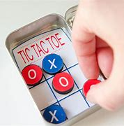

# Tic-Tac-Toe

**Tic-tac-toe** is a 1v1 competitive game where players take turns filling a board with their mark (or tokens, if using a phycial set) in an attempt to get "three-in-a-row". The game is traditionally played using X's and O's, but this is not a strict requirement and is done for simplicity as the game is often played written down on paper. Dedicated physical game boards, for example, may make use of very ornate pieces.

  
*In the game above, the blue "O" player (Player 2) wins by blocking red's (Player 1) attempt to get 3-in-a row vertically and then securing 3-in-a-row diagonally across the board.*

## How to play (Rules)

- A 3x3 grid is established or drawn up
- Players may take turns moving first, or may determine who plays first via coin toss or some other randomizing mechanism. It is also sometimes convention that the play who lost the previous round opens (goes first) the next round.
- One by one, each player picks a square from the grid and places their mark or piece in that square. This square is "theirs" until the game ends.

### Victory conditions
A winner is determined when a player aligns 3 of their tokens in a row horizontally, vertically, or diagonnaly

If all board spaces (9) have been used and a winner has not been determined, the game is a "draw" or "tie," and neither player is the winner or loser.

### Optimum strategy

According to Eric Buffington, a self declared (?) "tic-tac-toe master", claims that, so long as you go first, you can win or tie any game ([see video here](https://www.youtube.com/watch?v=5n2aQ3UQu9Y)). The strategy consists of picking the corners while blocking opponent attempts to get three-in-a-row. Once 3 of the 4 corners on the board have been taken, the player will usually have 2 paths to victory: diagonally and across. Since the opposing player can only block 1 of the 2 paths, on the next turn the other, non-bloacked path is taken and the player achieves victory.

## Variations

"Ultimate Tic-Tac-Toe" is a variation of tic-tac-toe where each square in the regular 3x3 grid  is itself a 3x3 grid (creating, in effect, a 9x9 board). Players can play any square during their turn, which makes defensive play more difficult. The winner of a 'mini' or 'localized' 3x3 grid gets the point for that square in the larger 3x3 grid. The game is played in this manner until the original conditions of victory (3 in a row) are satisfied on the larger or 'macro' grid.

"Connect 4" is a similar connection style game published by Milton Bradley / Hasbro. However, as pieces are dropped into spaces, there must be a piece below to support for placement in 'upper' rows. The physics of the board thereby have a dramatic effect on gameplay and optimal strategies beyond traditional tice-tac-toe. 

## Gallery

  
*A portable tic-tac-toe set (credit: Craftaholics Anonymous)*

  
*A "giant" lawn tic-tac-toe set (credit: Bounce 'N' More)*

  
*A tic-tac-toe game using footballs and soccer balls as symbols (credit: Love Bug Living)*

