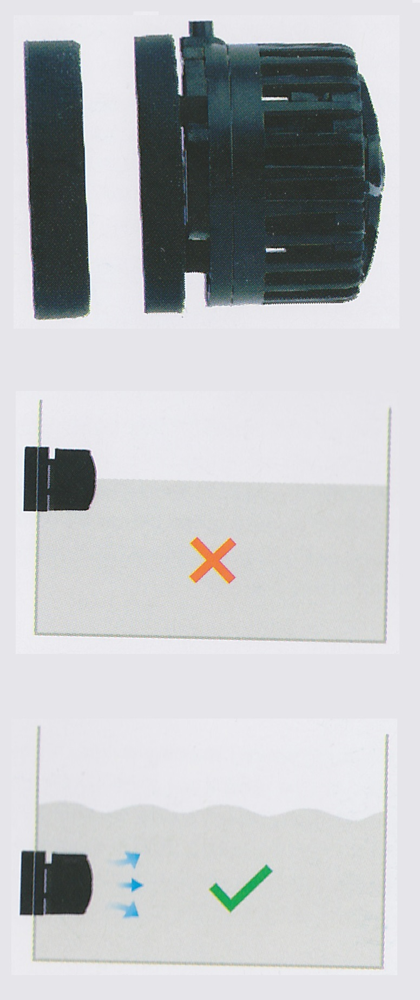
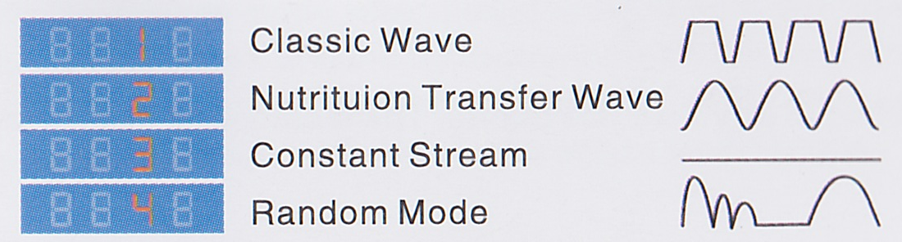

# Eco Slim wave maker

**Manufacturer**: [Hygger](http://www.hygger-online.com/)  
**Model**: HG-951

The Hygger Eco Slim wave maker has five time ranges (Dawn, Sunrise, Daylight, Sunset, and Moonlight). Each time range can be set with waves of custom intensity (power), type (wave mode), and frequency.

* [Installation](#Installation)
* [Control panel](#Control-panel)
  * [Feeding mode](#Feeding-mode)
  * [Power setting](#Power-setting)
  * [Wave modes](#Wave-modes)
  * [Wave frequency](#Wave-frequency)
* [Factory tide table](#Factory-tide-table)
* [Specifications](#Specifications)
* [Maintenance](#Maintenance)
* [Errors](#Errors)

## Installation

Install 15-20 centimeters below water level. The unit works in any orientation.

## Control Panel

### Feeding mode

Press **(F)** to stop the wave maker for feeding. The wave maker resumes operation after 10 minutes, or immediately if you press **(F)** again.

### Power setting

| Setting | Power |
|---|---|
| 1 | 40% |
| 2 | 60% |
| 3 | 80% |
| 4 | 100% |

### Wave modes

| Setting | Wave mode |
|---|---|
| 1 | Classic |
| 2 | Nutrition transfer |
| 3 | Constant |
| 4* | Random |

\* *Note*: Random mode is a combination of various settings. When random wave mode is selected, the power (2nd digit) and frequency (4th digit) cannot be set.

### Wave frequency

## Factory tide table

## Specifications

| Field | Value |
|---|---|
| Manufacturer | Hygger |
| Model | HG-951 |
| Flow rate | 6000 liters per hour |
| Tank | <60 centimeters |
| Max power | 14 Watts |
| Min power | 3 Watts |
| Voltage | 12 Volt direct current |
| Size | 48 x 48 x 49 millimeters |

## Maintenance

* Clean the wave pump regularly to ensure effective operation.
* Prevent water from entering the control box and keep the surface of the control box dry. Do not immerse the control box in water.
* To clear debris in pump body, first remove the hook brackets on both sides of the pump base, then remove the intermediate disc and impeller. Wipe the impeller with a soft cloth; clean the pump body with water.

## Errors

| Error code | Error type |
|---|---|
| ERR1 | Software overcurrent protection |
| ERR2 | Hardware overcurrent protection |
| ERR4 | Undervoltage protection |
| ERR5 | Overvoltage protection |
| ERR6 | Phase loss protection |
| ERR7 | Locked-rotor protection / Dry running protection |
| ERR8 | Startup failed |

