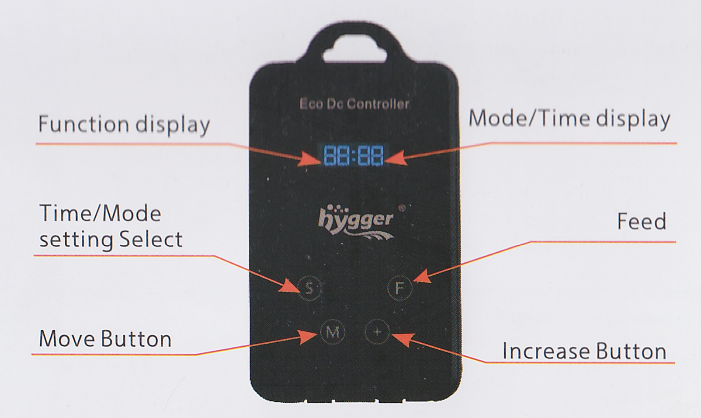
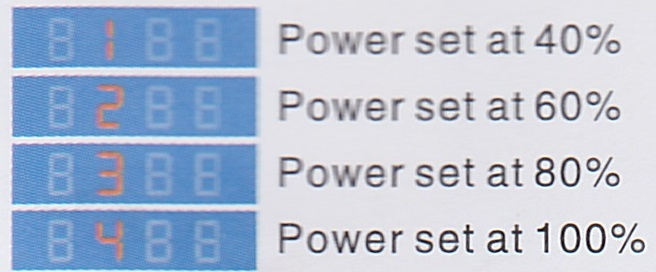
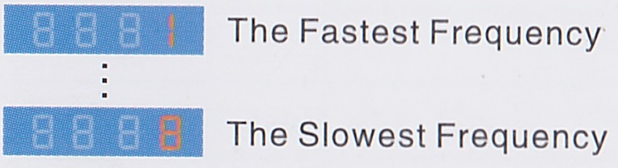
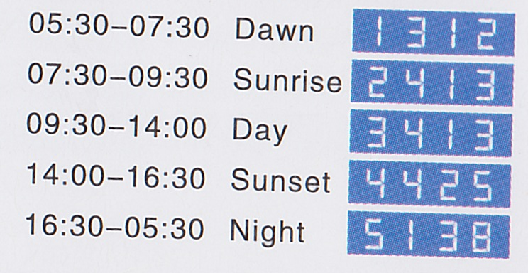

# Hygger Eco Slim (Wave maker)

* [Installation](#Installation)
* [Control panel](#Control-panel)
* [Feeding mode](#Feeding-mode)
* [Factory tide table](#Factory-tide-table)
* [Specifications](#Specifications)
* [Maintenance](#Maintenance)
* [Errors](#Errors)

The Hygger Eco Slim wave maker has five time ranges (Dawn, Sunrise, Daylight, Sunset, and Moonlight). Each time range make waves with a set:
* [Power setting](#Power-setting)
* [Wave modes](#Wave-modes), and 
* [Wave frequency](#Wave-frequency)

## Installation

Install 15-20 centimeters below water level. There is no "right side up."

## Control Panel

## Feeding mode

## Power setting

| Setting | Power |
|---|---|
| 1 | 40% |
| 2 | 60% |
| 3 | 80% |
| 4 | 100% |

## Wave modes

| Setting | Wave mode |
|---|---|
| 1 | Classic |
| 2 | Nutrition transfer |
| 3 | Constant |
| 4* | Random |

\* *Note*: Random mode is a combination of various settings. When random wave mode is selected, the power (2nd digit) and frequency (4th digit) cannot be set.

## Wave frequency

## Factory tide table

## Specifications

| | |
|---|---|
| Model | HG-951 |
| Flow rate | 6000 liters per hour |
| Tank | <60 centimeters |
| Max power | 14 Watts |
| Min power | 3 Watts |
| Voltage | 12 Volt direct current |
| Size | 48 x 48 x 49 millimeters |

## Maintenance

* Clean the wave pump regularly to ensure effective operation.
* Prevent water from entering the control box and keep the surface of the control box dry. Do not immerse the control box in water.
* To clear debris in pump body, first remove the hook brackets on both sides of the pump base, then remove the intermediate disc and impeller. Wipe the impeller with a soft cloth; clean the pump body with water.

## Errors

| Error code | Error type |
|---|---|
| ERR1 | Software overcurrent protection |
| ERR2 | Hardware overcurrent protection |
| ERR4 | Undervoltage protection |
| ERR5 | Overvoltage protection |
| ERR6 | Phase loss protection |
| ERR7 | Locked-rotor protection / Dry running protection |
| ERR8 | Startup failed |
