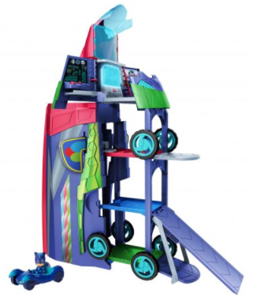
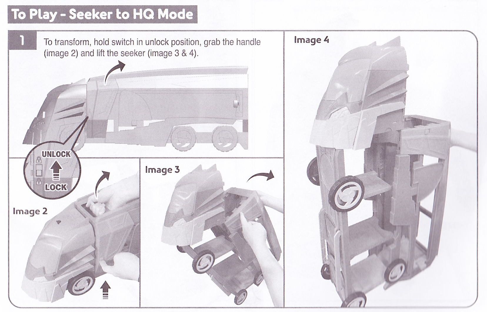

# PJ Masks 2 in 1 Mobile HQ

*Car Boy figure and Cat-Car included. Other vehicles and figures sold separately.  
Control Center requires 2 x AAA (LR03) batteries (not included).*

[Product page](https://justplayproducts.com/products/pj-masks-2-in-1-mobile-hq/)

**Manufacturer**: [Just Play](https://justplayproducts.com/) | PJ Masks | Frog Box | Entertainment One UK | Walt Disney EMEA 

**3+ - WAARNING - CHOKING HAZARD**  
Small parts. Not for children under 3 years / 36 months.  
Do not sit on the play set or place heavy objects on it.

*CAUTION*  
Have an adult remove and dispose of all packaging, ties, and fasteners before use.

The PJ Masks are on their way, into the night to save the day with the PJ Masks 2-in-1 Mobile HQ. Kids will love recreating their favorite episodes by transforming the PJ Masks Headquarters into the PJ Seeker. As the Headquarters, the Mobile HQ stands 3-feet tall and features five levels of play. Kids can use the lights and sounds control board on the fourth level to find their mission, just like the PJ Masks! Is it Romeo, Luna Girl, or Night Ninja causing mischief this time? It’s time to be a hero.

* [Play](#Play)
  * [Seeker to HQ mode](#Seeker-to-HQ-mode)
  * [HQ to Seeker mode](#HQ-to-Seeker-mode)
* [Labels information](#Labels-information)
* [Safety](#Safety)
  * [Batteries](#Batteries)
  * [FCC Class B verification](#FCC-Class-B-verification)

* [Questions or comments](#Questions-or-comments)

## Play

### Seeker to HQ mode

1. To transform, hold switch in unlock position, grab the handle (Sub image 2) and lift the Seeker (Sub images 3 & 4).
1. Expand HQ by lifting cabin and opening side doors.
1. Slide locking tab to release Catboy's ramp.
1. Fold down Owlette ramp.
1. To lift elevator, press and hold handle.

### HQ to Seeker mode

1. First, fold Owlette's ramp to up position. Then, fold Catboy ramp up and slide locking tab into place. Last, fold Gekko's ramp in up position.
1. Close side doors, then fold cabin down.
1. Make sure elevator is in bottom position.
1. To transform, hold switch in unlock position, grab the handle, and fold down into Seeker mode.

## Labels

## Battery safety

Reuires 2x AAA (LR03) batteries (not included)

To replace batteries, unscrew cover using a Phillips screwdriver. Note polarity of batteries, remove and replace with new batteries.

Replacement of batteries must be done by an adult. Dispose of batteries safely. Never dispose of batteries in fire, as they may leak and explode.

- Non-rechargeable batteries are not to be recharged.
- Rechargeable batters are to be removed from the toy before being charged.
- Rechargeable batteries are only to be charged under adult supervision.
- Different types of batteries or new and used batteries are not to be mixed.
- Batteries are to be inserted with the correct polarity.
- Exhausted batteries are to be removed from the toy.
- The supply terminals are not to be short-circuited.

CAUTION: Changes or modification not expressely approced by the party responsible for compliance could void the user's authority to operate the equipment.

## FCC Class B Verification

This equipment has been tested and found to comply with the limits for a class B digital device, pursuant to part 15 of the FCC Rules. These limits are designed to provide reasonable protection against harmful interference in a residential installation. This equipment generates, uses and can radiate radio frequency energy and if not installed and used in accordance with the instructions, may cause harmful interference to radio communications. However, there is no guarantee that interference will not occur in a particular installation. If this equipment does cause harmful interference to radio or television reception, which can be determined by turning the equipment off and on, the user is encouraged to try to correct the interference by one or more of the following measures

Reorient or relocate the receiving antenna

Increase the separation between the equipment and receiver

Connect the equipment into an outlet on a circuit different from that to which the receiver is connected

Consult the dealer or an experienced radio/TV technician for help

This device complies with Part 15 of the FCC Rules. Operation is subject to the following two conditions: (1) This device may not cause harmful interference and (2) this device must accept any interference received, including interference that may cause undesired operation.

## Questions or comments

[Contact webpage](https://justplayproducts.com/contact/)

Just Play logo (C) 2020 Just Play, LLC
4850 T-Rex Ave, Suite 100
Boca Raton, FL 33431, USA

In the interest of better quality and value, we are constantly improving and updating our products. Consequently, pictures on this package may sometimes vary from the product enclosed. Please retain this address for future reference.

