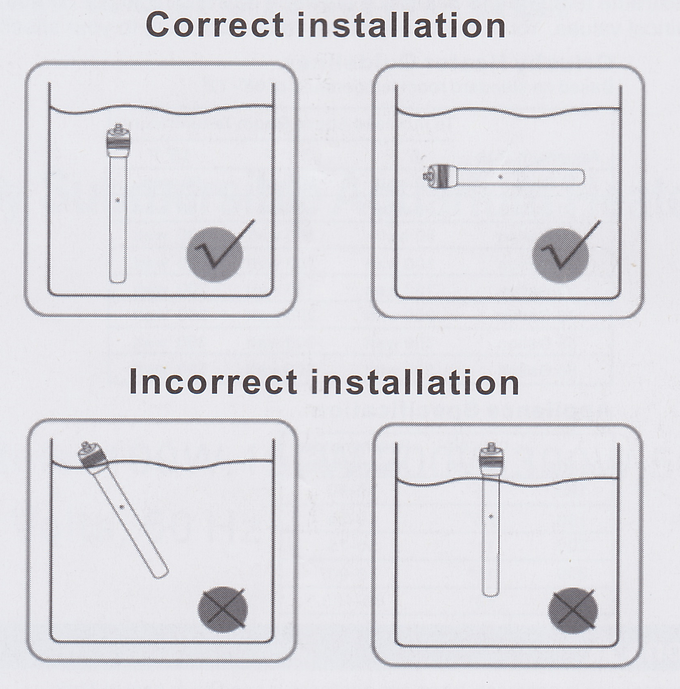
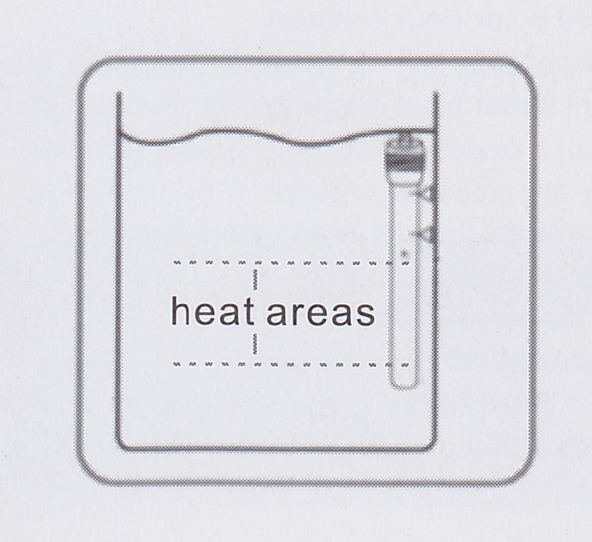

# Fully submersible aquarium heater

**Manufacturer**: [Orlushy](https://www.amazon.com/s?k=Orlushy&ref=bl_dp_s_web_19262582011)  
**Model**: **100W**, 150W, 200W, 300W, 500W

Thank you for choosing our quartz aquarium heater. Before use, please read this product manual carefully for a better understanding of the features and the correct usage of our product. Please keep this manual properly for future reference or to contact us.

As the most mainstream material for aquarium heaters on the market, quartz glass has high thermal conductivity. With the adoption of bimetallic strip for temperature control, its 2mm thickness can be used for both freshwater and saltwater aquariums due to its simple structure and high functional reliability.

* [Cautions](#Cautions)
* [Installation](#Installation)
* [Temperature control](#Temperature-control)
* [Troubleshooting](#Troubleshooting)
* [Heater power choice](#Heater-power-choice)
* [Contact](#Contact)
* [Specs](#Specs)

## Cautions

## Installation

## Temperature control

## Troubleshooting

## Heater power choice

## Contact

After-sales mail: admin@aquastation.cn

## Specs

| Spec | Value |
|---|---|
| Power supply | 120 Volt 60 hz |
