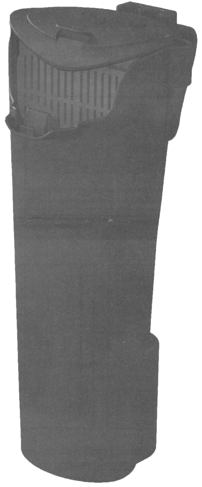
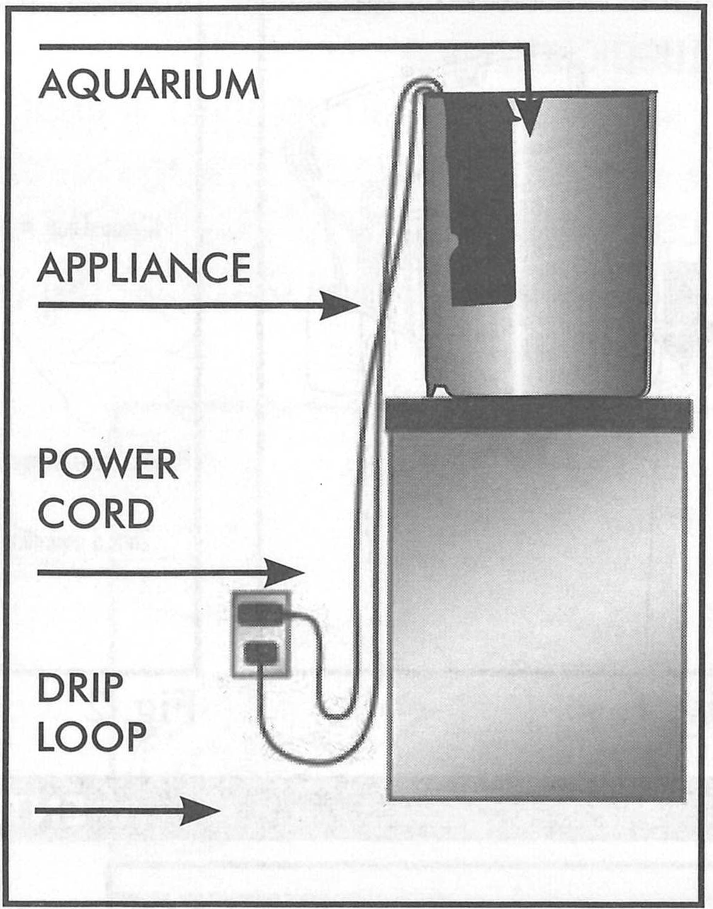
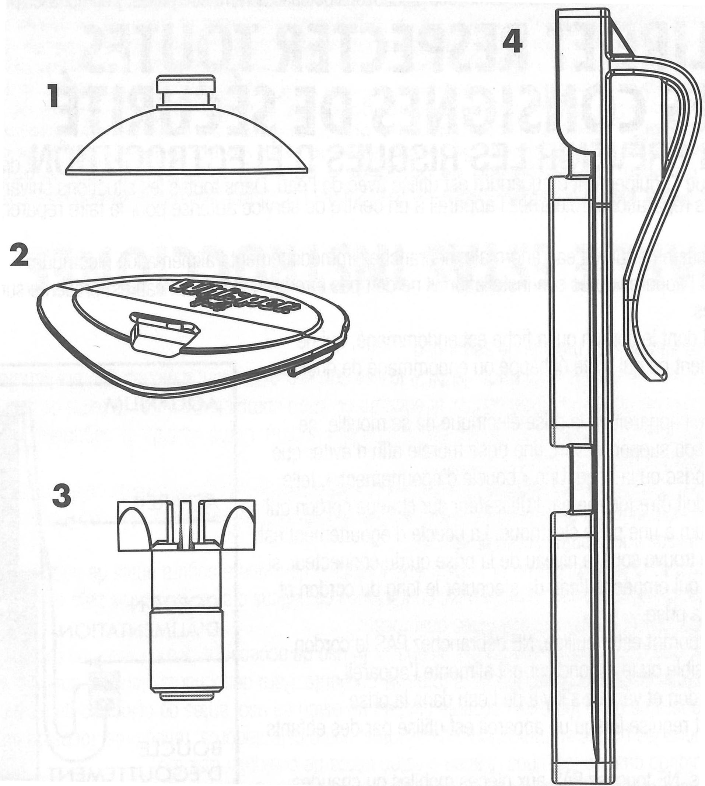
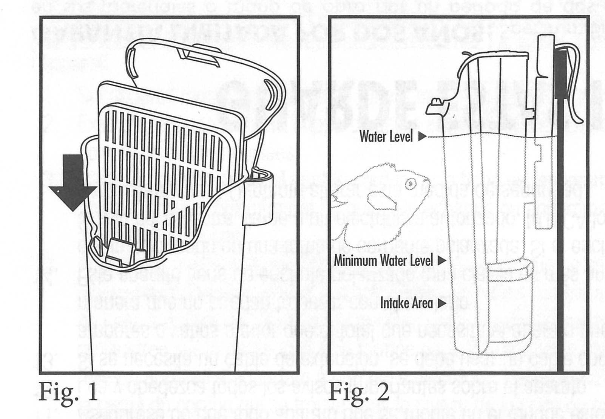
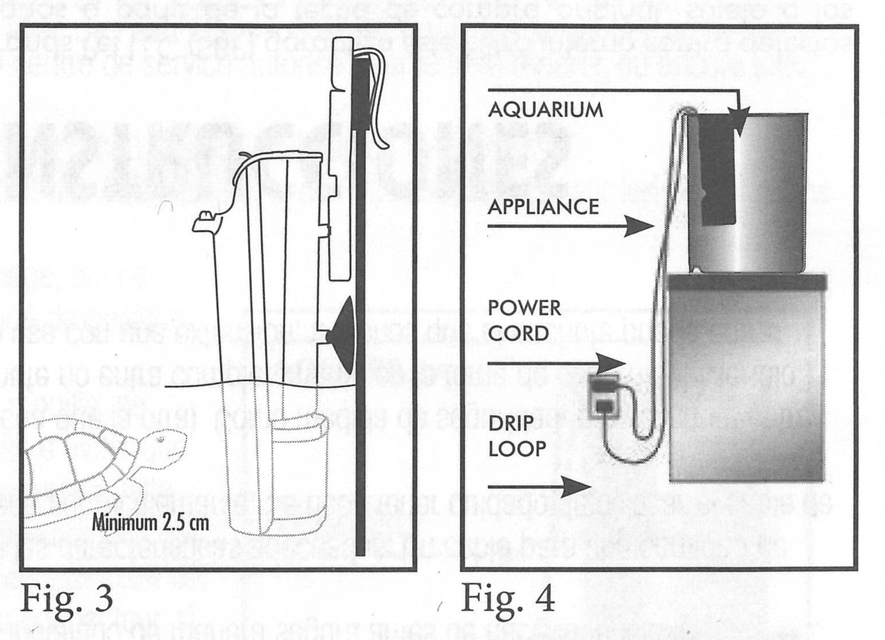
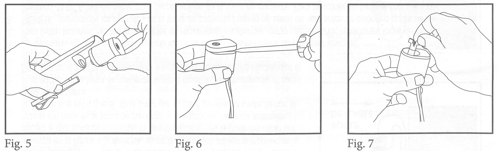

# Tetra Internal Power Filter

*Spectrum Brands Pet LLC*

**Important**  
Always unplug the internal filter before inspecting or disassembling for any reason.

Replace Small Tetra® Whisper® Filter Cartridge monthly.

* [Safety-instructions](#Safety-instructions)
* [Parts](#Parts)
* [Installation](#Installation)
* [Maintenance](#Maintenance)
* [Warranty](#Warranty)
* [Contact](#Contact)

## Safety-instructions

**READ AND FOLLOW ALL SAFETY INSTRUCTIONS**

**WARNING** - To guard against injury, basic safety precatutions should be observed, including the following instructions.

**DANGER** - TO AVOID POSSIBLE ELECTRIC SHOCK, speecial care should be taken since water is employed in the use of the aquarium equipment. For each of the following situations, DO NOT attempt repairs by yourself; return the appliance to an authorized service facilty for service or discard the appliance:

1. If the appliance shows any sign of abnormal water leakage, immediately unplug it from the power source.
1. Carefully examine the appliance after installation. It should not be plugged in if there is water on parts not intended to get wet.
1. DO NOT operate any appliance if it has a damaged cord or plug, or if it is malfunctioning or has been dropped or damaged in any manner.
1. To avoid the possibility of the appliance plug or receptacle getting wet, position aquarium stand and tank to one side of a wall-mounted receptacle to prevent water from dripping onto the receptacle or plug. A "drip loop," shown in the figure below, should be arranged by the user for each cord connecting an aquarium appliance to a receptacle. The drip loop is that part of the cord below the level of the receptacle, or the connector if an extension cord is used, to prevent water traveling along the cord and coming in contact with the receptacle.
    
1. If the plug or receptacle does get wet, DO NOT unplyg the cord. Disconnect the fuse or circuit breaker that supplies power to the appliance. Then, unplug and examine for presence of water in the receptacle.
1. Close supervision is necessart when any appliance is used by or near children.
1. To avoid injurt, DO NOT contact moving parts or hot parts such as heaters, reflectors, lamp bulbs, and the like.
1. Always unplug an appliance from an outlet when not in use, before putting on or taking off parts, and before cleaning. NEVER yank cord to pull plug from outlet. Grasp the plag and pull to disconnect.
1. DO NOT use an appliance for other than intended use. The use of attachments not recommended or sold by the appliance manufacturer may cause an unsafe condition.
1. DO NOT install or store the appliance where it will be exposed to the weather or to temperatures below freezing.
1. Make sure an appliance mounted on a tank is securely installed before operating it.
1. Read and observe all the important notices on the appliance.
1. If an extension cord is necessary, a cord with a proper rating should be used. A cord rated for less amperes or watts than the appliance rating may overheat. Care should be taken to arrange the cord so that it will not be tripped over or pulled.
1. This appliance has a polarized plug (one blade is wider than the other). As a safety feature, this plug will fit in a polarized outlet only one way. If the plug does not fit fully in the outlet, reverse the plug. If it still does not fit, contact a qualified electrician. NEVER use with an extension cord unless plug can be fully inserted. DO NOT attempt to defeat this safety feature.

## Parts

| Key | Item description | Item number |
| --- | --- | --- |
| 1 | Suction cup | 19612|
| 2 | Lid | AQ-78242|
| 3 | Impeller | AQ-78241|
| 4 | Hanger | AQ-78240|

## Installation

1. Lift the filter cover. Rinse the cartridge with tap water and place in filter as shown (Fig. 1).
1. Install the filter inside the back of your aquarium using the clip provided.
1. Adjust the clip on the back of the filter to position between max and min water levels (Fig. 2).
1. If the hanger doesn't fit, or if you can't position the filter to your desired water level, you may need to follow assembly suggestion in Fig. 3.
1. Once the filter water level is within the recommended parameters, plug in the filter, adding a drip loop for safety (Fig. 4). Avoid using sand in the aquarium, as this clogs the filter.

## Maintenance

1. The filter cartridge should be replaced monthly (or more often if needed). To change cartridge, unplug the filter to stop the water flow, remove the old cartridge, rinse a new cartridge in clean water, then replug the filter.
1. Remove the filter cartridge when medicating fish, as it absorbs most medications.
1. To clean the filter, unplug the unit and use a clean, wet cloth. If needed, add white distilled vinegar to the cloth, then rinse the filter thoroughly.
1. To service the impeller monthly, or if the motor is noisy, unplug the filter and remove it from the aquarium. Pull the motor off the filter body (Fig. 5), pop open the cover by using a screwdriver (Fig. 6), remove impeller by pulling up on the blades (Fig. 7). and flush debris with clean water. Soak the impeller in distilled white vinegar using a cotton swab to wipe debris, and rinse. Replace the motor into the filter and install it in the aquarium reversing the instructions in this manual.
1. It takes a few weeks for a new aquarium water to cycle. "Cycling" a fish tank means growing healthy bacteria on a new filtration system so it filters out dangerous toxins. Tetra® SafeStart (TM) aquarium bacteria cycle your aquarium immediately, so you can add fish right away. As the aquarium cycles, you will notice cloudiness that will last a few days to a week as the bacteria settle. This is normal; do not perform water changes during this time.

## Warranty

**Two-year limited warranty**  
Spectrum Brands Pet LLC (SBP) warrants this Internal Filter against defects in material or workmaship for two years from the date of original purchase, subject to the conditions and exceptions stated below. Your sales receipt is your Proof-of-Date-of-Purchase. If the Internal Filter exhibits such a defect, SBP will repair or replace it, at our option, without cost for parts or labor. The Internal Filter must be shipped postage paid to SBP. Proof-of-Date-of-Purchase is required. You are responsible for proper shipping. Call Customer Service at 800-526-0650 for shipping address. This warranty does not cover damage caused by accident, misuse, abuse, or failure to follow the instructions accompanying this Internal Filter. All implied warranties, including any implied warranty of merchantability or fitness for any purpose are limited to two years. Fish and plant loss, personal injury, property loss or damage (direct, incidental, or consequential) resulting from the use of this Internal Filter are not covered by this warranty. Because some states/provinces do not allow the exclusion or limitation of incidental or consequential damages, or allow limitations on how long an implied warranty lasts, the above limitations or exclusion may not apply to you. This warranty gives you specific legal rights. You may also have other rights which vary from state/province to state/province. Manufactured for Spectrum Brands Pet LLC, 3001 Commerce St., Blacksburg, VA 24060.

## Contact

**Questions or missing parts?**  
Call Customer Service at 1-800-526-0650  
Monday through Friday 
8 AM - 5 PM EST

---

Spectrum Brands Pet LLC  
30001 Commerce St., Blacksburg, VA 24060  
1-800-526-0650  
www.tetra-fish.com  
®/TM/© 2020 Spectrum Brands, Inc. or one of its affiliates  
Made in China
