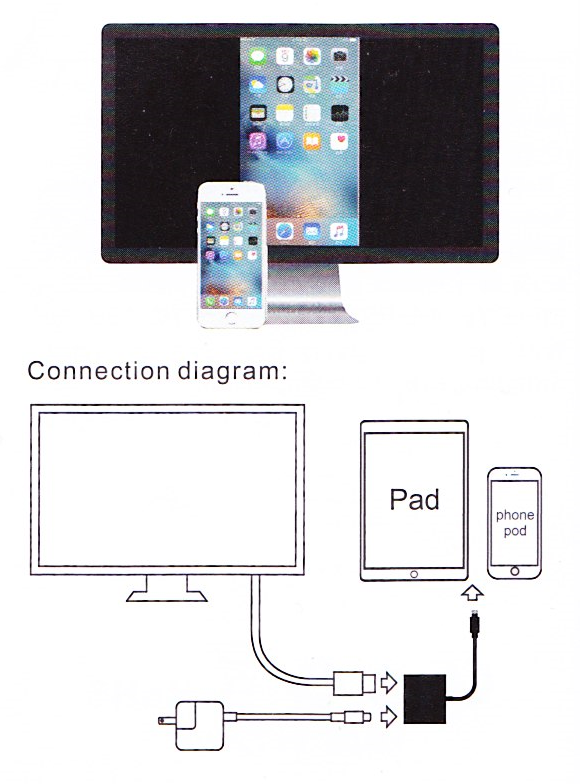

# Lightning digital AV adapter

**Manufacturer**: Valoin

For iPad, iPod, iPhone (5, 5s, 6s, 6s plus, 7, 7 plus, 8, 8 plus, x, x plus)

## Product information

The Lightning Digital AV adapter with your Apple with Lightning connector. Product supports mirroring of what is displayed on your device screen - including apps, presentations, websites, slideshows, and more - to your HD-equipped TV, display, projector, or other compatible display in up to 1080p HD. Simply attach the adapter to your device and then to your TV or projector via an HD cable.

## User guide

* Connect HDMI to HDTV
* Connect adapter to AC adapter (5V, 2A) via Apple USB cable
* Connect lightning plug to device
* Wait about 15 seconds to complete initial connection
* Video should be sharing to HDTV

## Disclaimer

Due to intellectual property issues in this product, the following video sites are not currently supported:

* Netflix, Google Movies, Amazon Prime video, Yomvi, Line TV, Popom Time, CBS CNNGO, BT SPORT, SBS, Periscope, Tonton, Iflix, IPTV, Hulu, Unext, DTV, HBO Go, Molotov.tv, Sling Tv, Xfinity, PTCL Smart TV, TSN Go, Workout, Fox Sports Go, ESPN, Hbonow, SlingBox, Fubo TV, Vudu, Foxtel

Made in China
