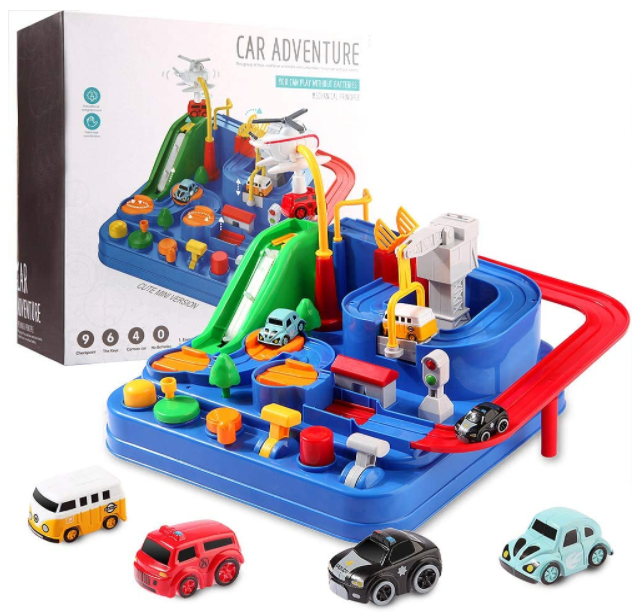
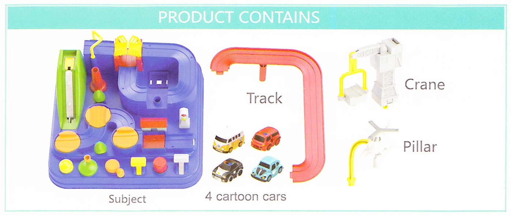
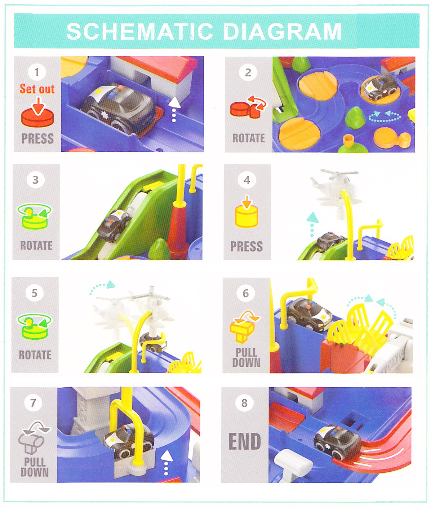

# Car Adventure toy

**Manufacturer**: [Wemfg](https://www.amazon.com/s?k=Wemfg&ref=bl_dp_s_web_20794160011)

1. Exercise your child's reflexes
1. Exercise your child's grip
1. Develop children's color cognition
1. Brave each checkpoint with mechanical linkage

This group of toys used lever and track inertia to make the car run without battery.

* [Set up](#Set-up)
* [Parts](#Parts)
* [How to use](#How-to-use)

## Set up

## Parts

* Base
* Track and pillars
* 4 cartoon cars
* Crane
* Helicopter

## How to use

